# Exercise 1
## Running Containers
Showing running containers with command "docker images":

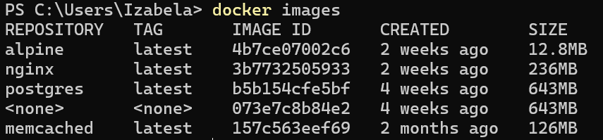

Searching for a specific image with command "docker search <name>":

Pulling an image from DockerHub

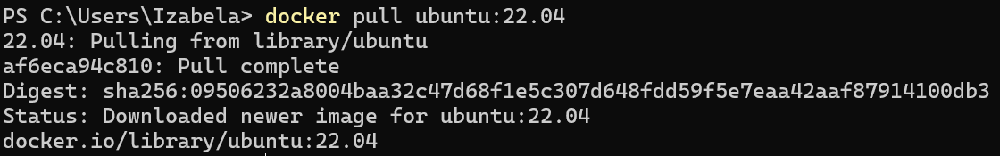

Pulling a diffrent version of an image:

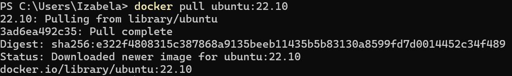

Running "docker images" again:

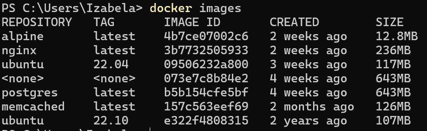

Deleting the Ubuntu 22.10 image:

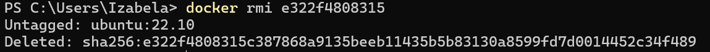

Running "docker images" again :

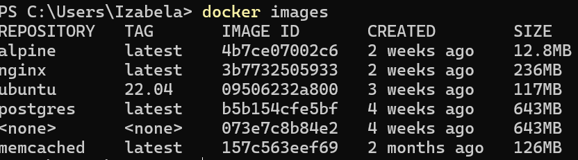

Deletig all images from the system - If a container is currently running, its image will remain:

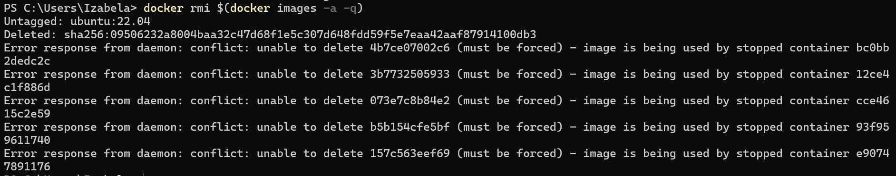

Running ubuntu:22.04 container to show text "Hello World!" :

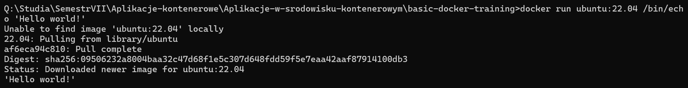

Running command "docker ps":

Running previous command with a flag "-a":

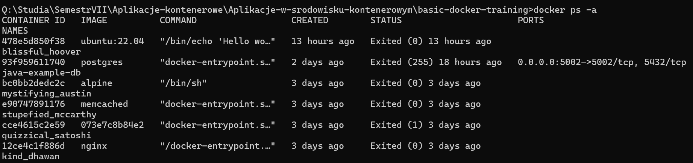

Running "docker run ubuntu:22.04 /bin/bash":

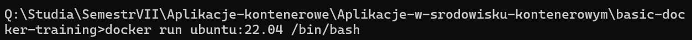

Then showing all containers:

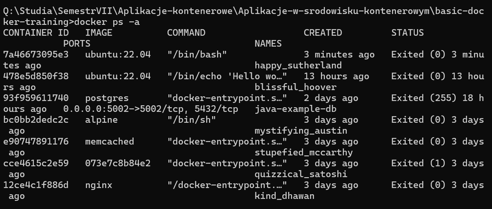

Entering a bash session in ubuntu container:

Looking at the file system with Linux commands:

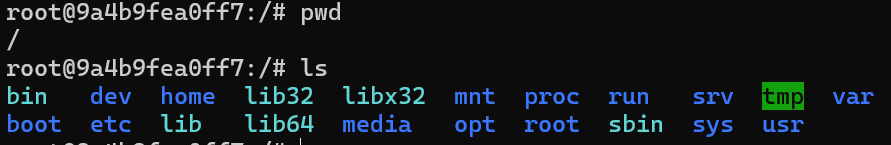

Running "/bin/sleep 3600" in detached mode:

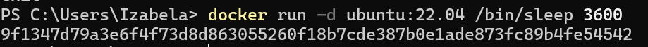

Checking the container:

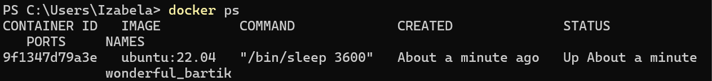

Using docker exec, rather than docker run.The ID is different from the previous image due to the container being restarted:

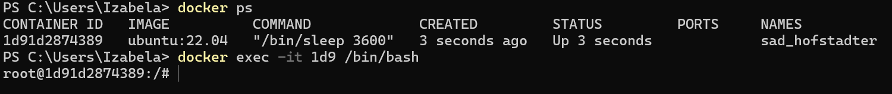

Listing the running processes:

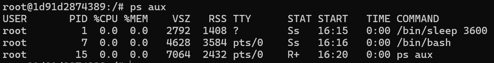

Container is still running, even after exit:

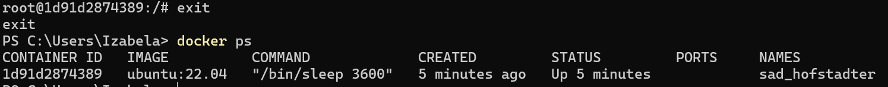

Stoping a container and seeing results:

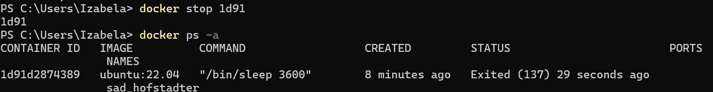

Showing all containers:

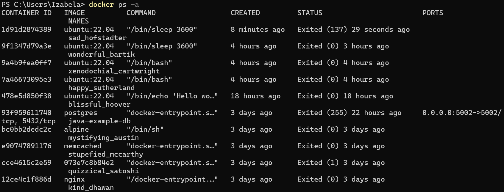

Removing a container:

# Exercise 2
## Changing images

For this excercise we're pulling ubuntu 16.04 image

