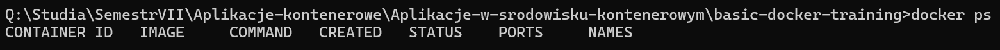

# Exercise 1
Showing running containers with command "docker images":

Searching for a specific image with command "docker search <name>":

Pulling an image from DockerHub

Pulling a diffrent version of an image:

Running "docker images" again:

Deleting the Ubuntu 22.10 image:

Running "docker images" again :

Deletig all images from the system - If a container is currently running, its image will remain:

Running ubuntu:22.04 container to show text "Hello World!" :

Running command "docker ps":

Running previous command with a flag "-a":

Running "docker run ubuntu:22.04 /bin/bash":

Then showing all containers:

