# Exercise 1
## Running Containers
Showing running containers with command "docker images":

Searching for a specific image with command "docker search <name>":

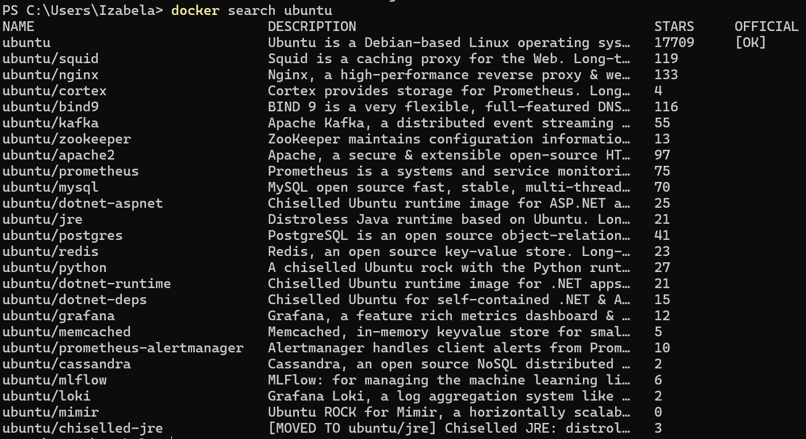

Pulling an image from DockerHub

Pulling a diffrent version of an image:

Running "docker images" again:

Deleting the Ubuntu 22.10 image:

Running "docker images" again :

Deletig all images from the system - If a container is currently running, its image will remain:

Running ubuntu:22.04 container to show text "Hello World!" :

Running command "docker ps":

Running previous command with a flag "-a":

Running "docker run ubuntu:22.04 /bin/bash":

Then showing all containers:

Entering a bash session in ubuntu container:

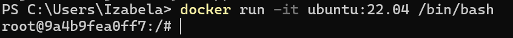

Looking at the file system with Linux commands:

Running "/bin/sleep 3600" in detached mode:

Checking the container:

Using docker exec, rather than docker run.The ID is different from the previous image due to the container being restarted:

Listing the running processes:

Container is still running, even after exit:

Stoping a container and seeing results:

Showing all containers:

# Exercise 2
## Changing images

Pulling ubuntu 16.04 image:

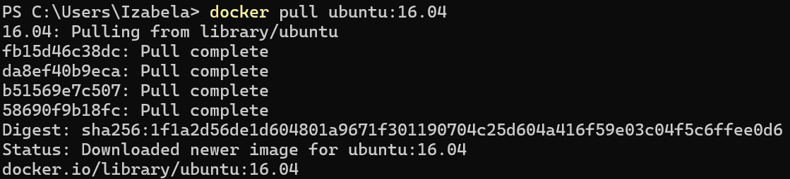

Starting a container and trying command "ping":

Updating list of available software:

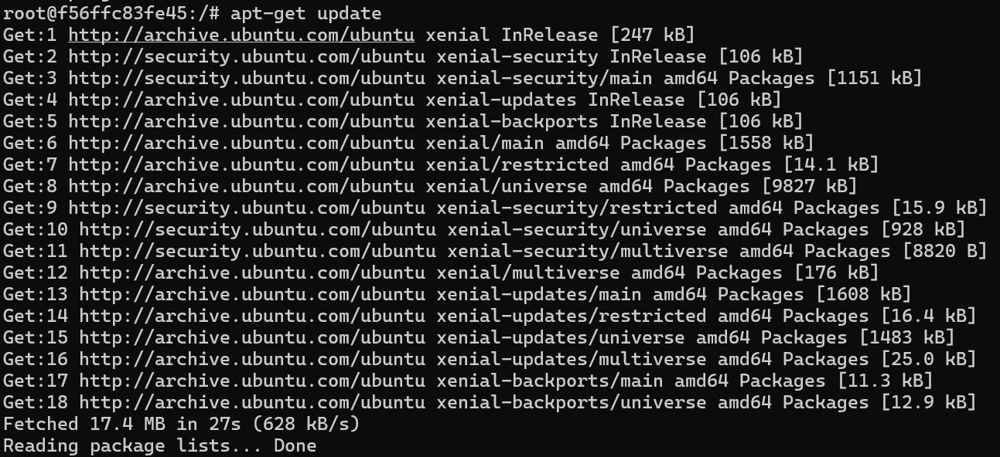

Installing "ping" command:

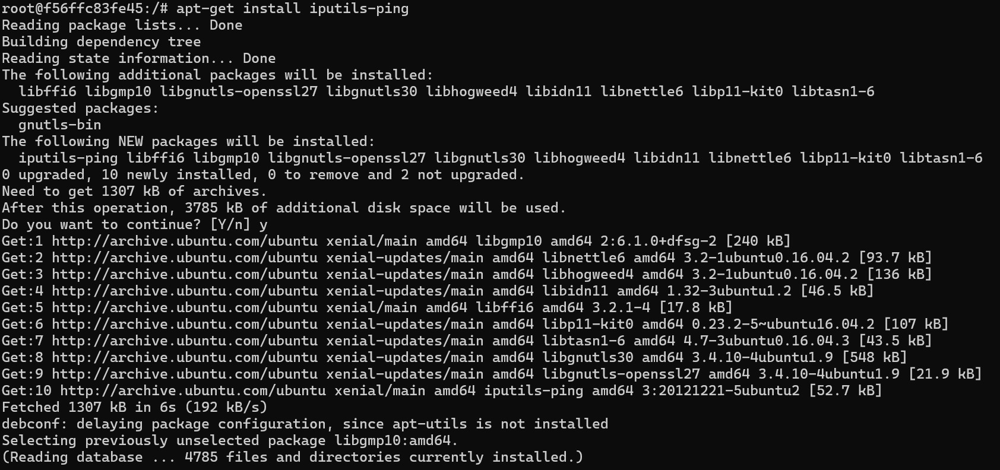

Finally using "ping":

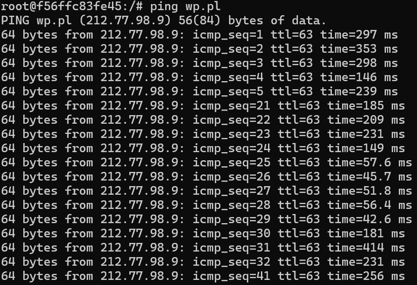

Committing a container state as a new image:

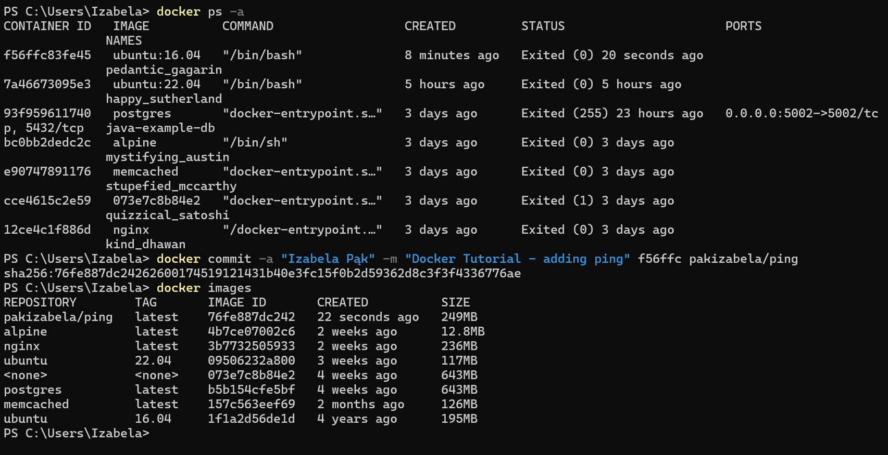

Trying new image:

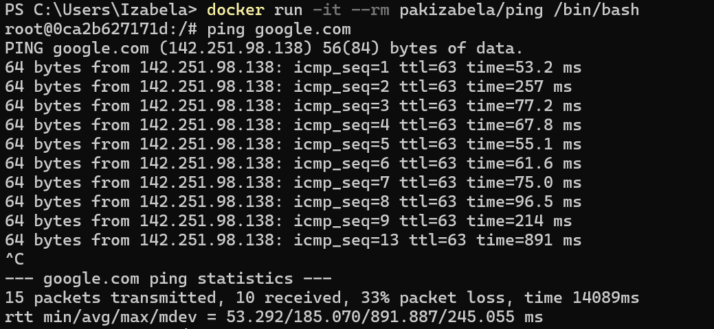

# Exercise 3
## Building images

Building an image from Dockerfile:

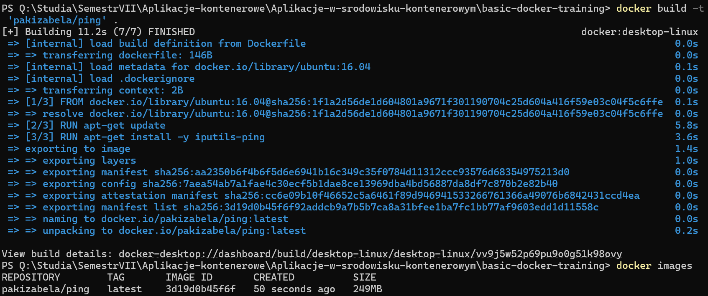

Optimizing the Dockerfile:

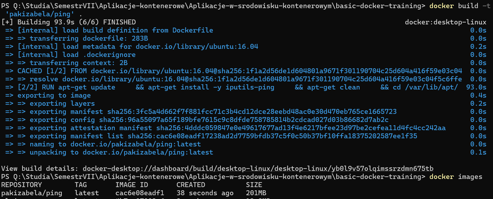

Trying other Dockerfile directives:

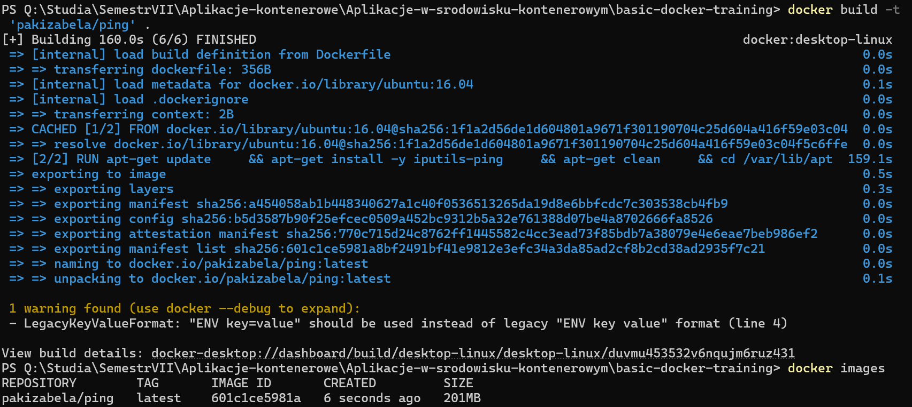

# Exercise 4
## Sharing images
