# Section 1

Uruchomienie kontenera na podstawie obrazu ubuntu i pobranie źródła strony Google

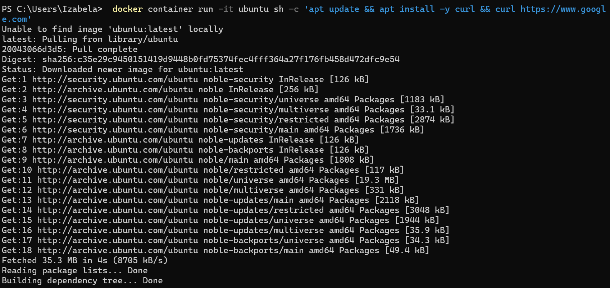

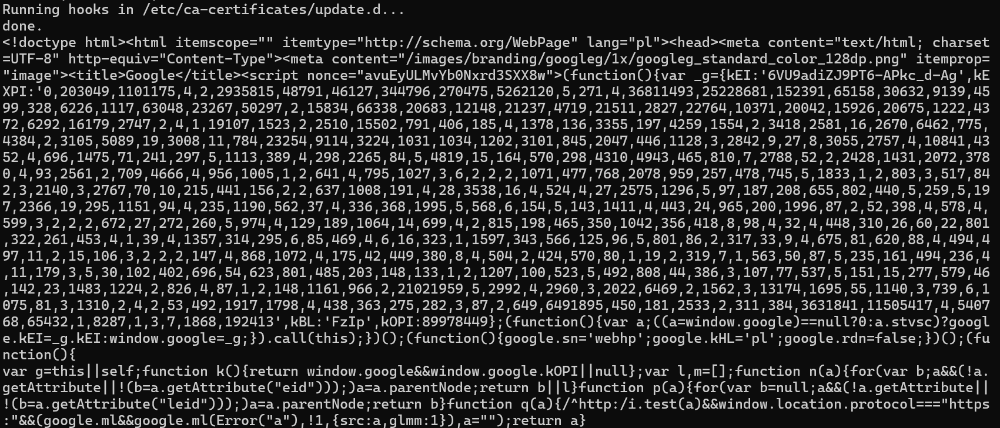

Usunięcie kontenera oraz dodanie i usunięcie obrazu

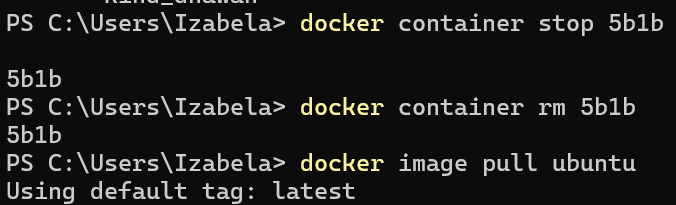


# Section 2

Porównanie uruchamiania kontenera bez flagi, z flagą -t oraz z flagą -it. Dodatkowo uruchomienie kontenera i przekazanie mu gotowej komendy do wykonania

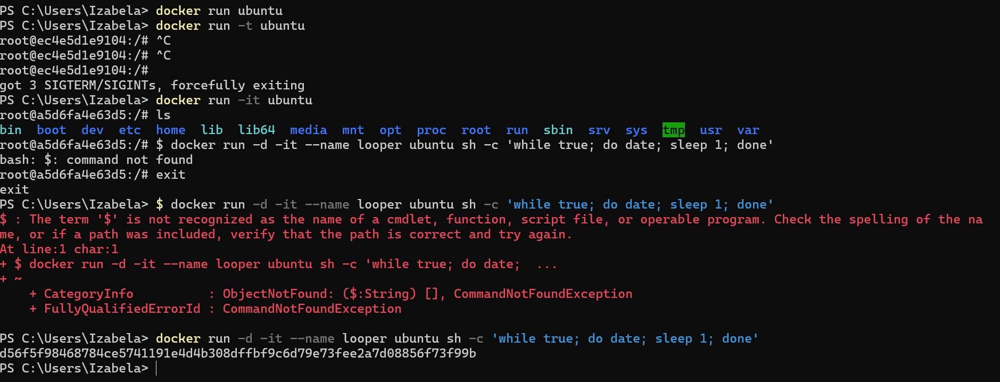

Sprawdzanie logów

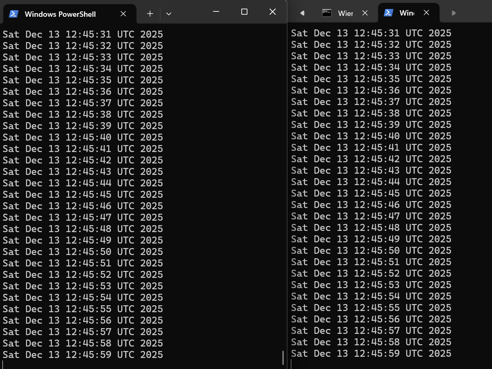

Wykonanie polecenia listującego wszystkie pliki w domyślnym katalogu działającego kontenera

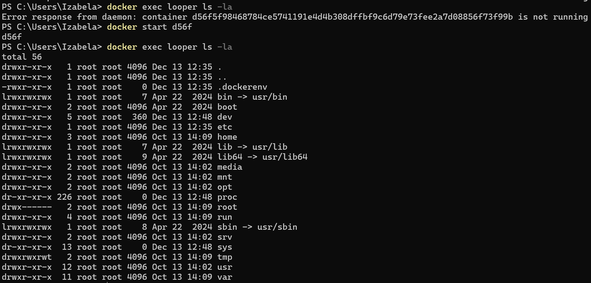

Uruchomienie powłoki Bash w kontenerze w trybie interaktywnym

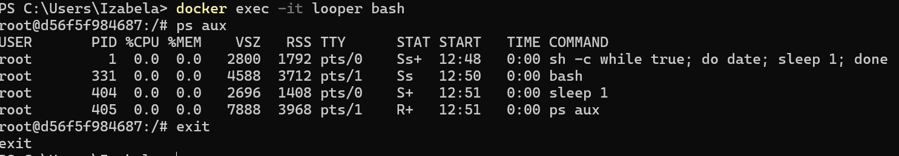

Zatrzymanie i usunięcie kontenera 

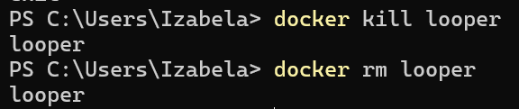

Uruchomienie procesu z automatycznym usunięciem się po zakończeniu

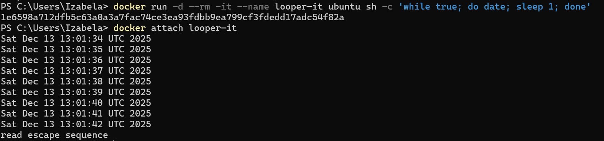

## Ćwiczenia

Obraz devopsdockeruh/simple-web-service:ubuntu uruchomi kontener, który zapisuje logi do pliku. Wejdź do działającego kontenera i użyj tail -f ./text.log, aby śledzić logi. Co 10 sekund zegar wyśle Ci „sekretną wiadomość”.

Prześlij sekretne hasło i użyte polecenia w odpowiedzi.

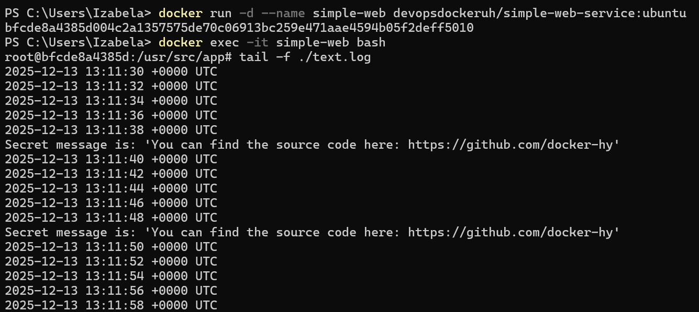

Uruchom obraz Ubuntu z procesem sh -c 'while true; do echo "Input website:"; read website; echo "Searching.."; sleep 1; curl http://$website; done'

Zauważysz, że brakuje kilku elementów wymaganych do poprawnego działania. Przypomnij sobie, jakich flag użyć, aby kontener faktycznie czekał na dane wejściowe.

```
 docker run -it ubuntu sh -c "apt update && apt install -y curl && while true; do echo 'Input website:'; read website; echo 'Searching..'; sleep 1; curl http://$website; done"
```
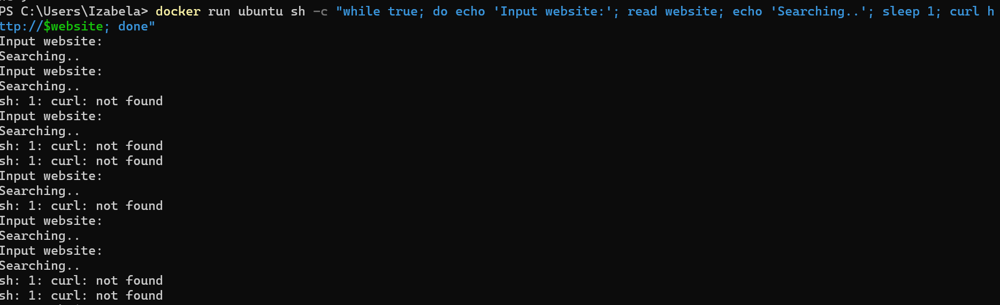

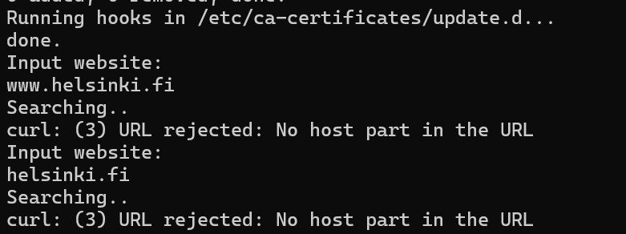

# Section 3

Wyszukiwanie obrazów

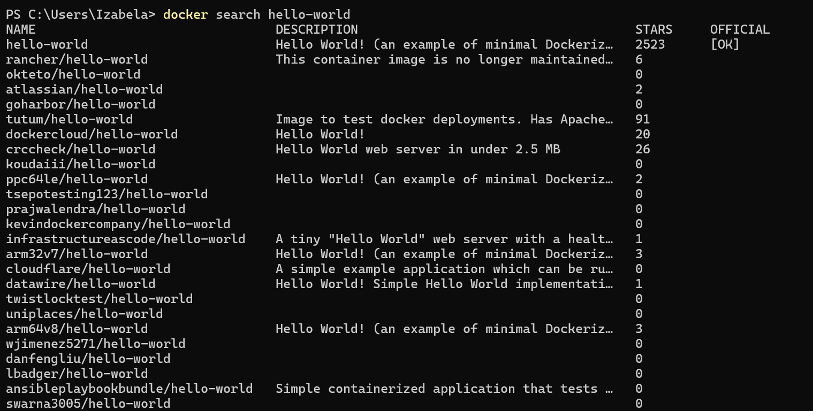

Obraz alpine jest niemal sześciokrotnie mniejszy od obrazu ubuntu

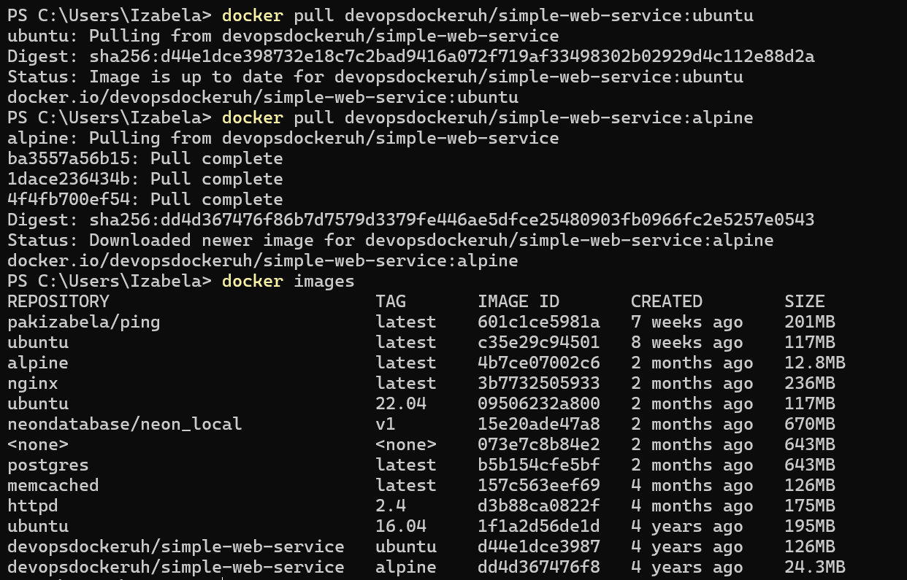

Utworzenie obrazu z pliku Dockerfile

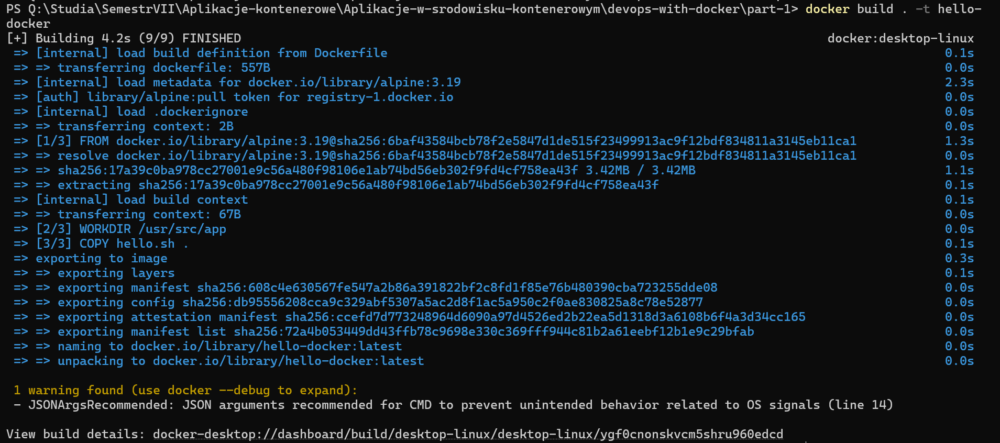

Uruchomienie kontenera, skopiowanie do niego pliku i zobaczenie zmian

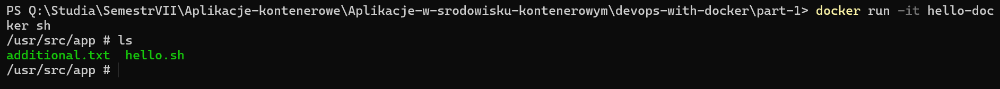

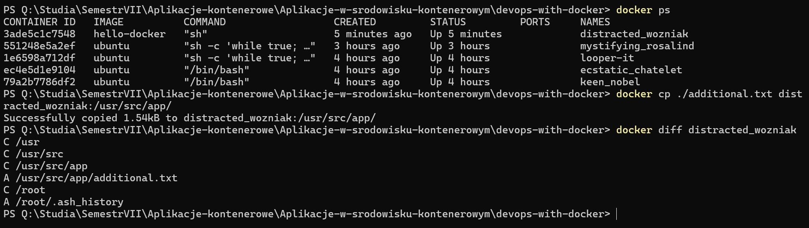

Zapisanie zmian jako nowy obraz

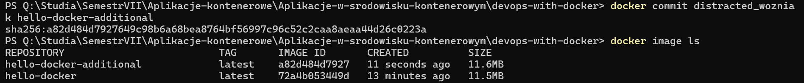

## Ćwiczenia

Plik Dockerfile na bazie, którego został utworzony obraz curler

```
FROM ubuntu:22.04

WORKDIR /usr/src/app

RUN apt-get update \
    && apt-get install -y curl \
    && rm -rf /var/lib/apt/lists/*

COPY script.sh .

CMD ./script.sh

```
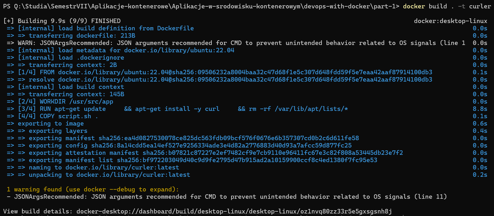

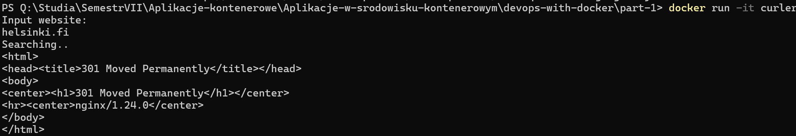

Plik Dockerfile na bazie, którego został utworzony obraz web-server, który uruchamia server

```
FROM devopsdockeruh/simple-web-service:alpine
CMD ["server"]
```


