# Section 1

Użycie Docker Compose do budowy i wypychania obrazu

Dodanie wolumenu w Docker Compose

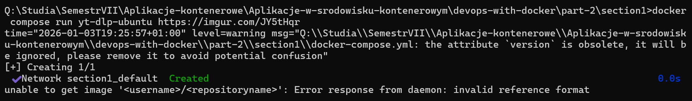

# Section 3

Inicjalizacja plików danych przez obraz przy pierwszym uruchomieniu.

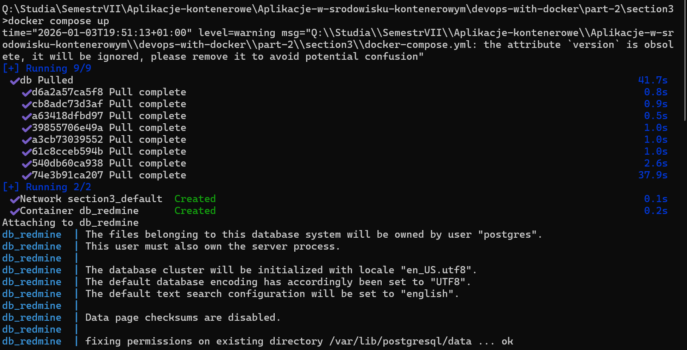

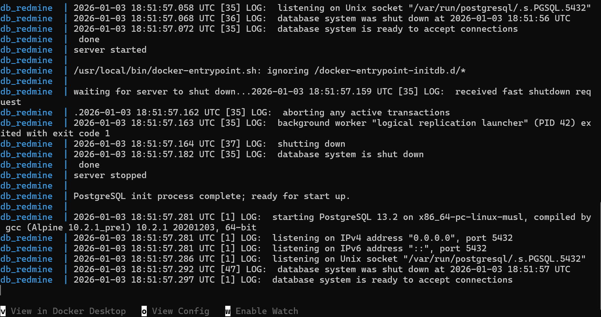

Sprawdzenie utworzenia woluminu przy pomocy komendy "docker container inspect db_redmine"

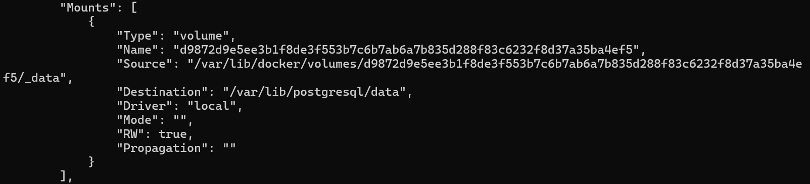

Wyświetlenie listy woluminów

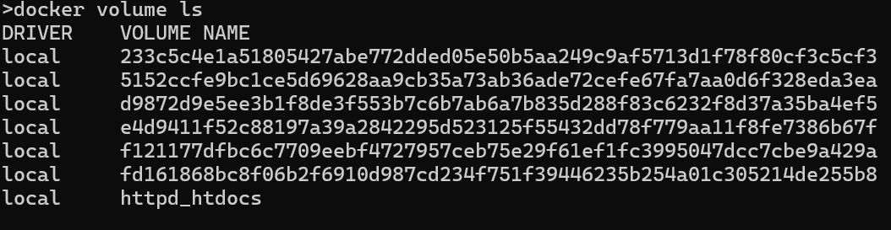

Zmienienie definicji woluminu i sprawdzenie go po ponownym inicjalizowaniu plików

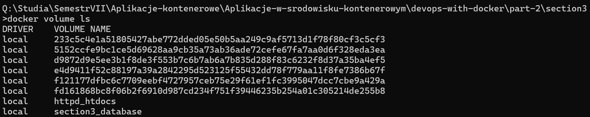

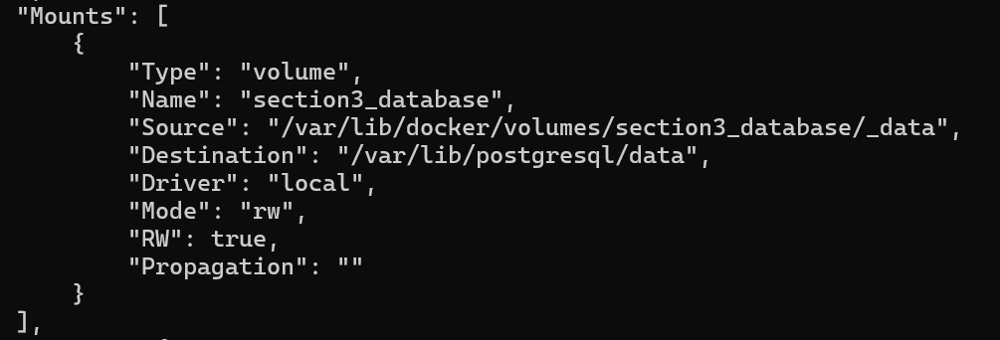

Możliwość korzystania z aplikacji, po zmianie pliku docker-compose

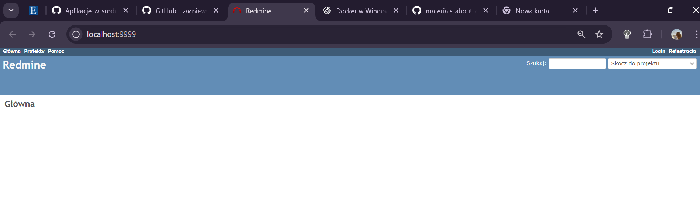

Wejście do baz danych

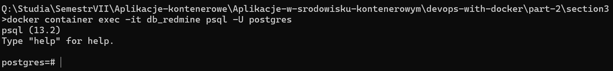

Wejście na stronę Admirera:

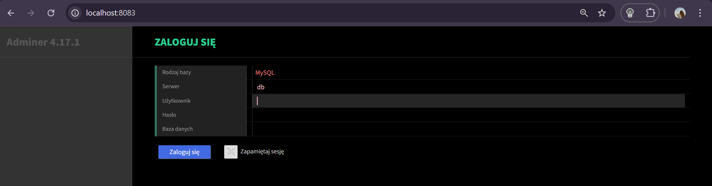

# Section 4

Uruchomienie aplikacji

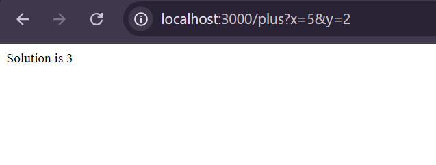

Poprawienie funkcji w index.js

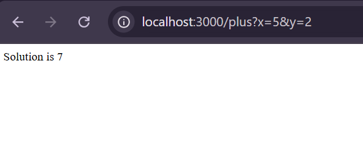

