# Section 1

Sprawdzenie historii obrazu

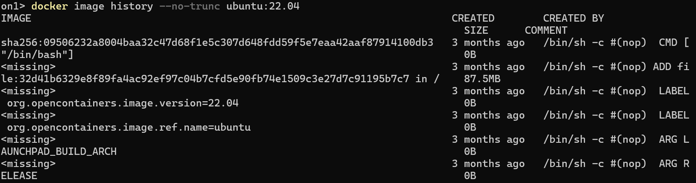

# Section 3

Utworzenie obrazu z Dockerfile

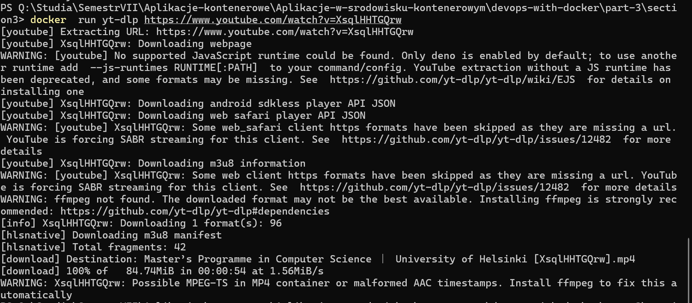

# Section 4 

Sprawdzenie rozmiaru pierwszej wersji obrazu - 304MB

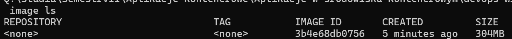

Sprawdzenie rozmiaru drugiej wersji obrazu - 298MB

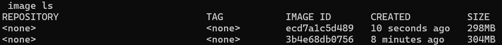

Sprawdzenie rozmiaru trzeciej wersji obrazu - 178MB

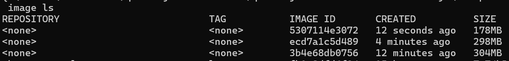

Sprawdzenie rozmiaru czwartej wersji obrazu - 172MB

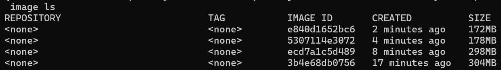

## Alpine Linux variant

Postawienie nowego obrazu o rozmiarze - 82.1MB

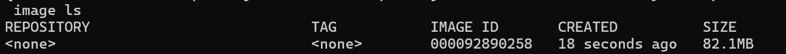

Zbudowanie obrazu z tagiem ":alpine-3.19" i uruchomienie go

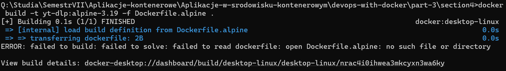

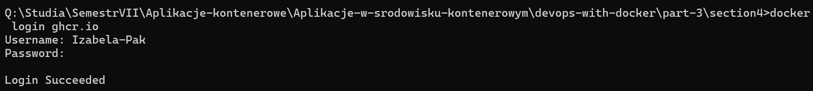

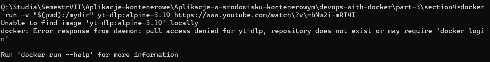

## Image with preinstalled environment

Zbudowanie nowego obrazu o rozmiarze 80.7MB

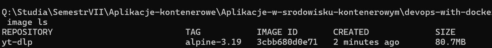

Próba wysłania obrazu do Docker Hub - niestety brak dostępu do repozytorium

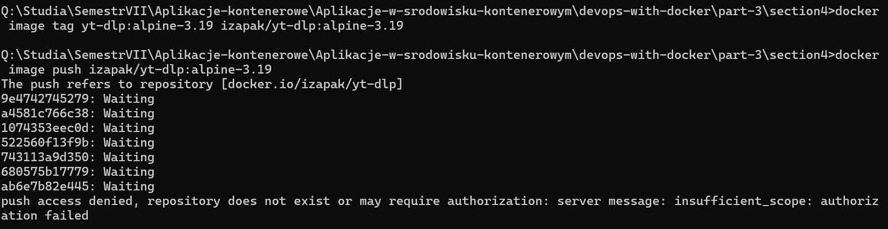

## Multi-stage builds

Utworzenie obrazu Jekyll 

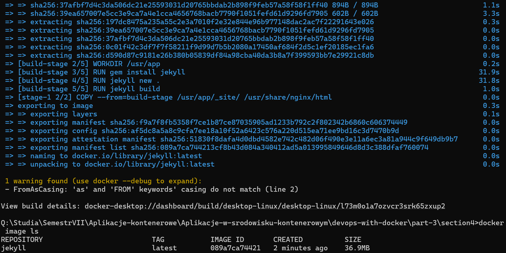