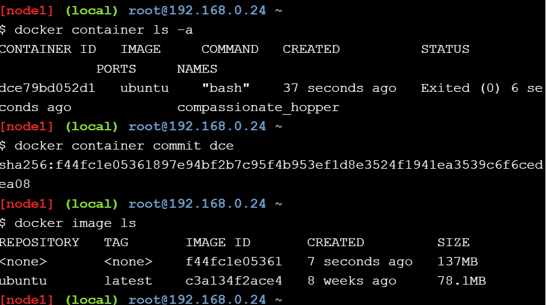
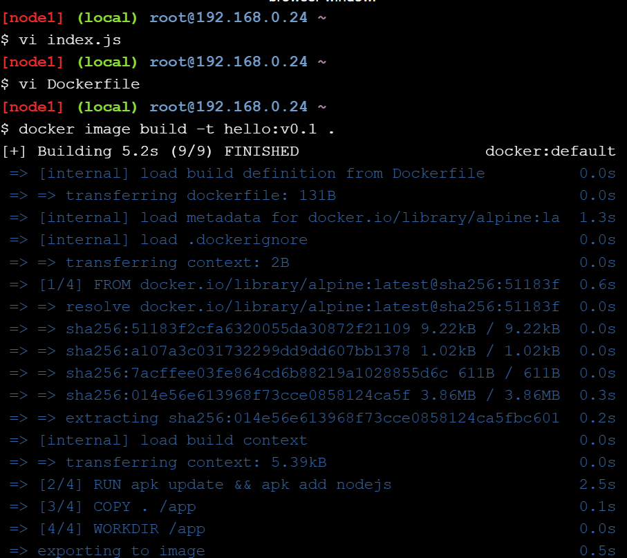
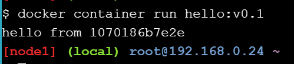
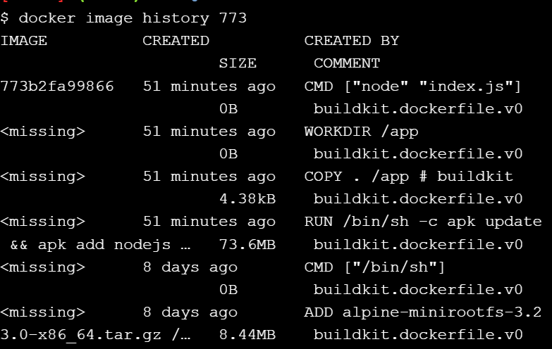
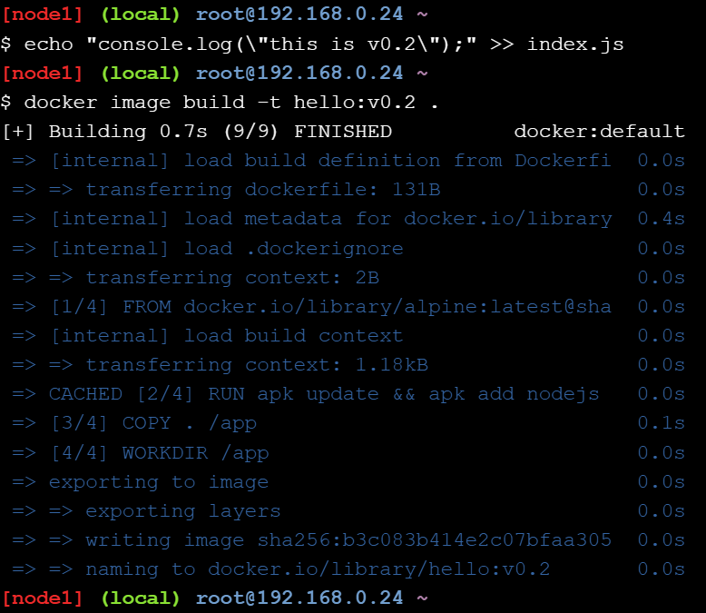
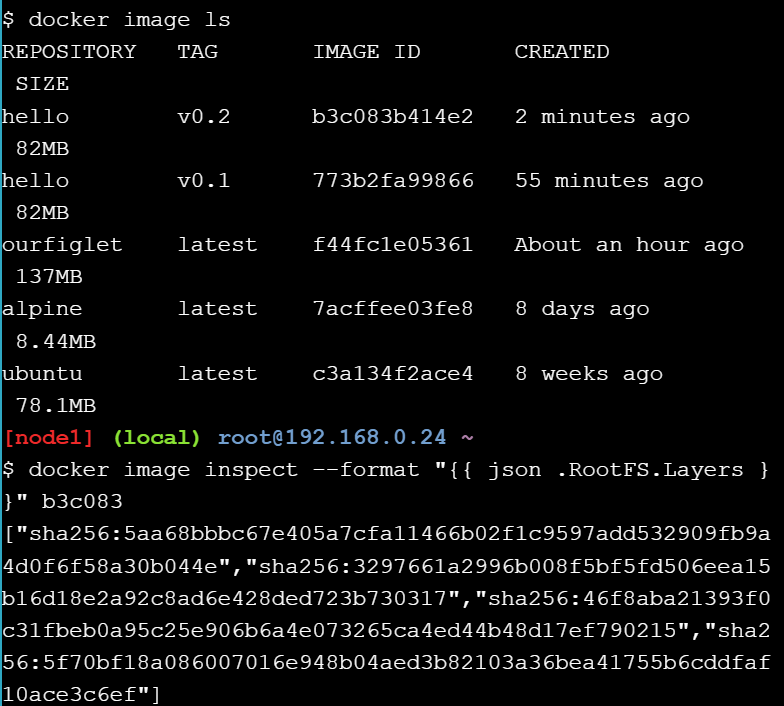

# Image creation from a container

Utworzenie obrazu

Ustawienie nazwy obrazu

# Image creation using a Dockerfile

Utworzenie potrzebnych plików i na ich podtawie zbudowanie nowego obrazu

# Image layers

Wyświetlenie historii obrazu

Edytowanie i zbudowanie nowej wersji obrazu

# Image Inspection

Sprawdzenie szczegółowych danych wcześniej utworzonego obrazu

