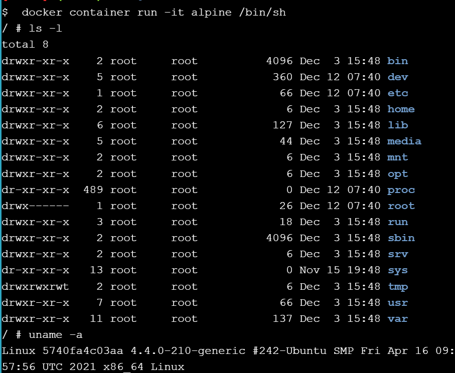
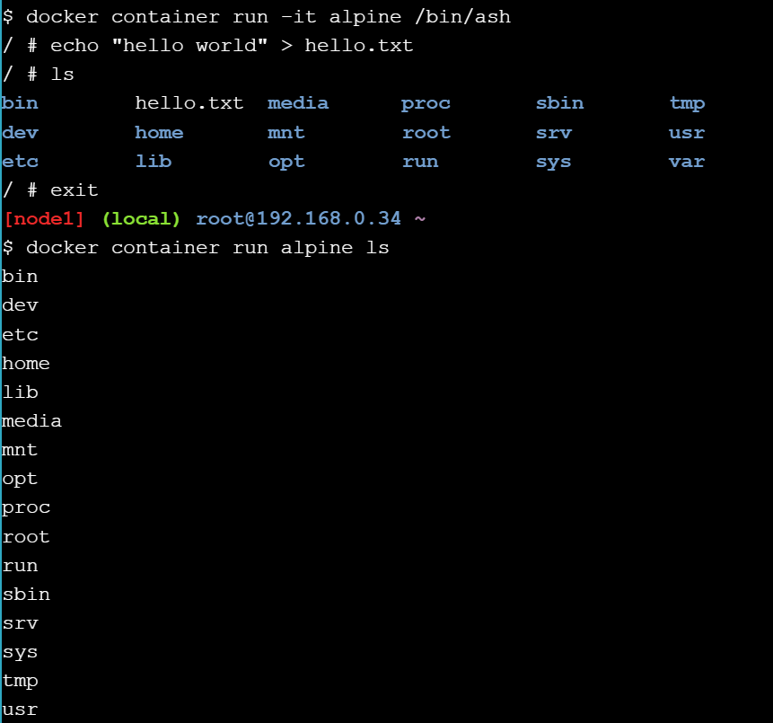
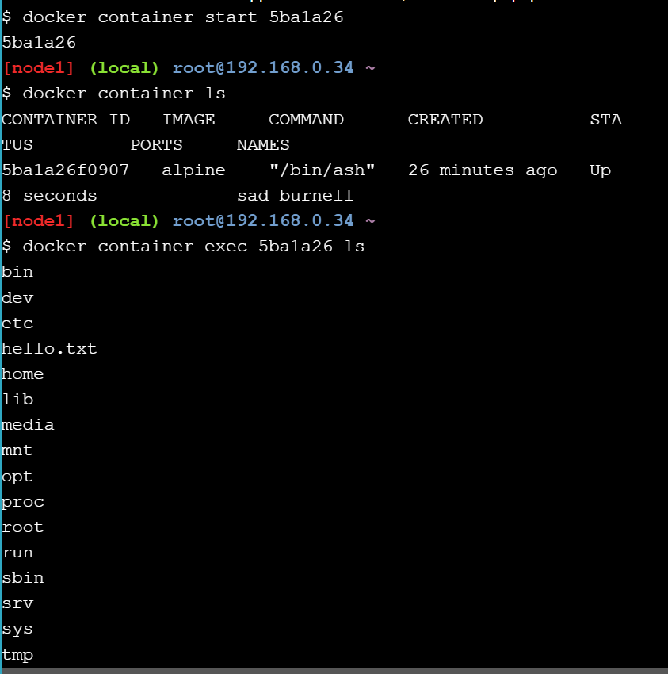

# 1.1 Docker Container Run

Uruchomienia kontenera w interaktywnym terminalu:

# 1.2 Container Isolation

Stworzenie pliku txt w kontenerze, a następnie próba wyświetlenia przed i po wyjściu z kontenera

Uruchomienie konkretnego kontenera i wyświetlenie jego instancji

