# Docker Networking

Wyświetlenie wszystkich sieci

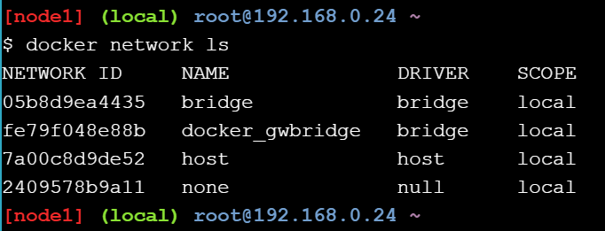

Dodanie i wyświetlenie mostów

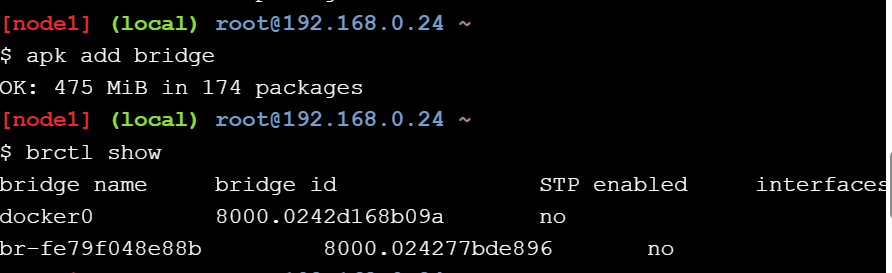

Ping

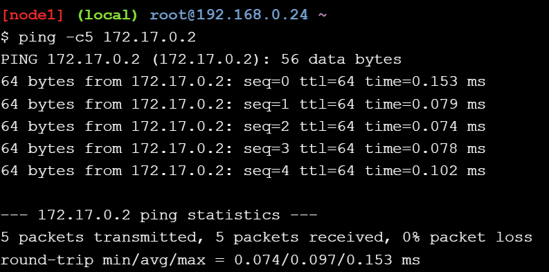

Uruchomienie kontenera

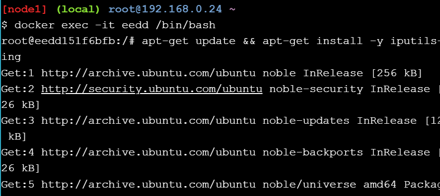

Ping po nazwie

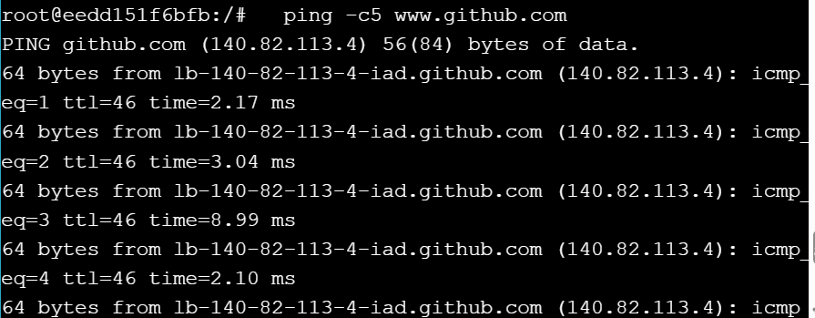

Test połączenia z kontenerem

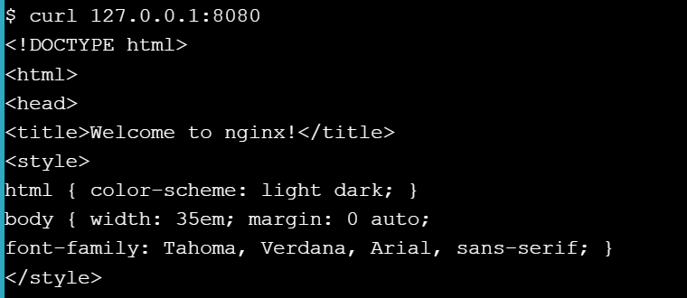

Uruchomienie Docker Swarm

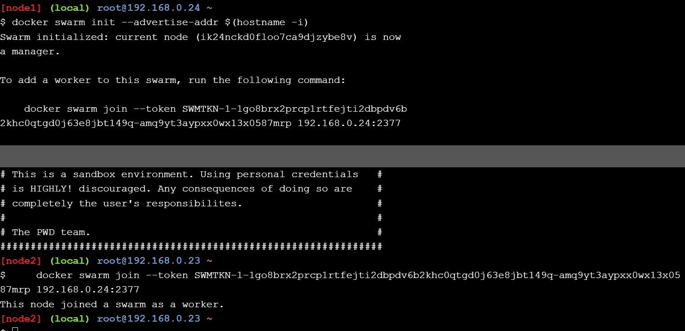

Wyświetlenie węzłów

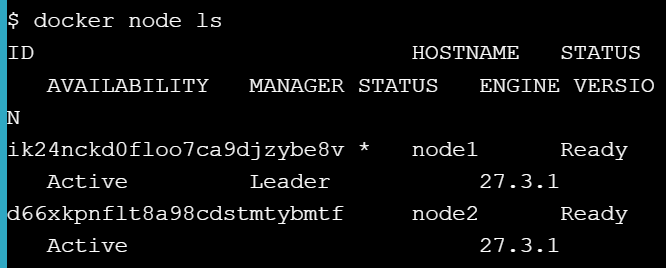

Utworzenie sieci typu overlay (Z dołączonego węzła jej nie widać)

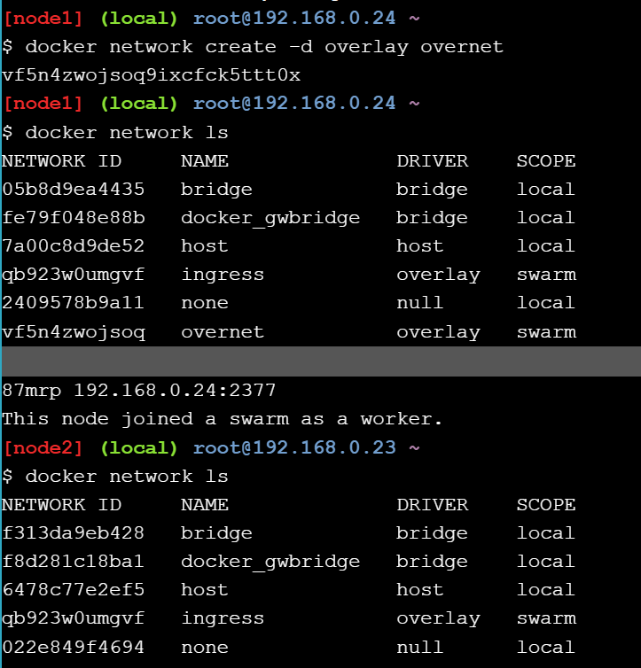

Utworzenie nowego serwisu

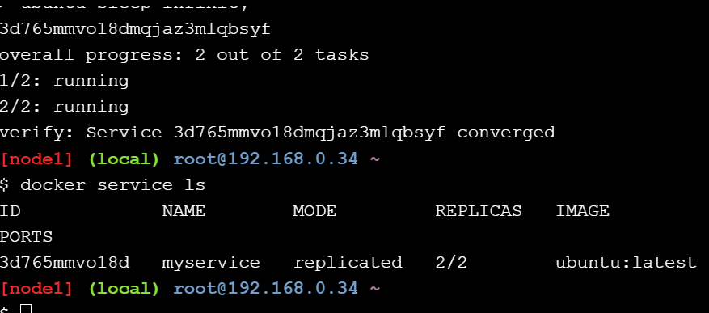

Podstawienie kontenera, zainstalowanie w nim ping i przetestowanie połączenia między węzłami

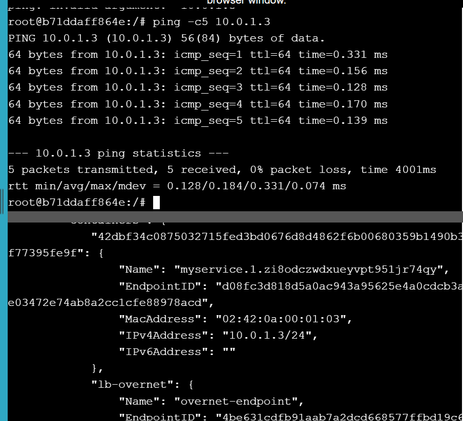

Zbadanie pliku resolv.conf

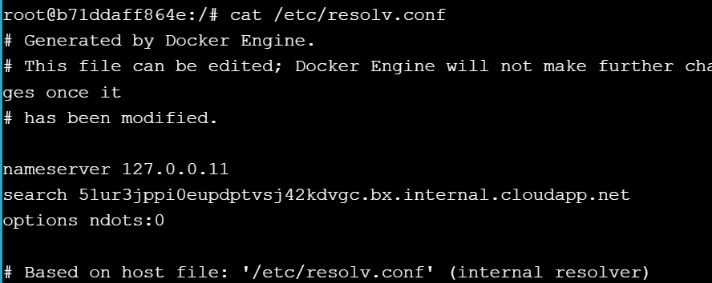

Przetestowanie komendy "ping myservice"

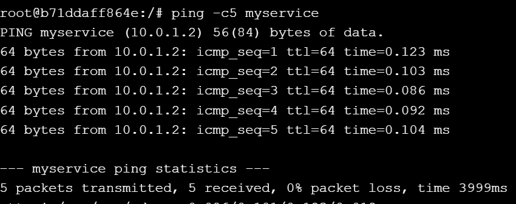

Wyczyszczenie utworzonego serwisu

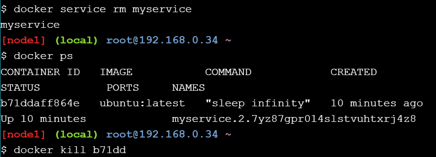

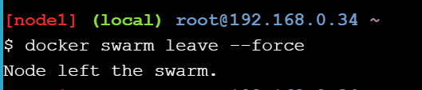
