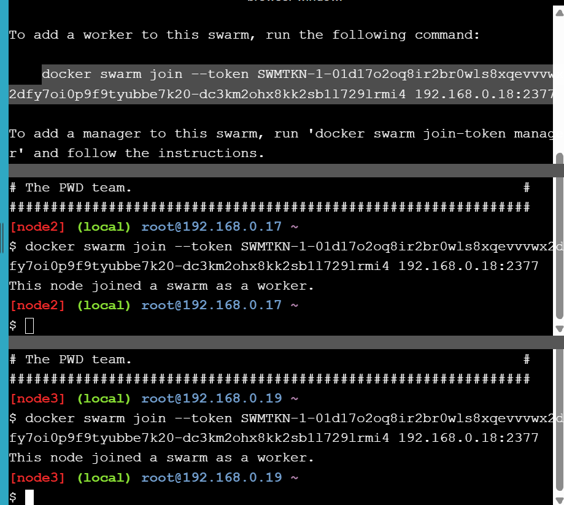
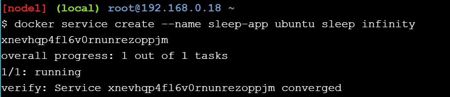
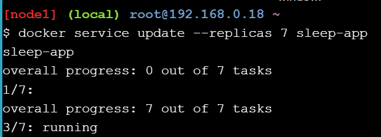
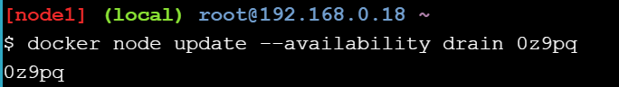
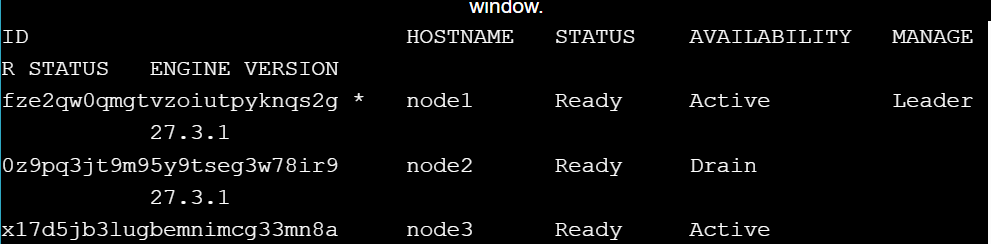
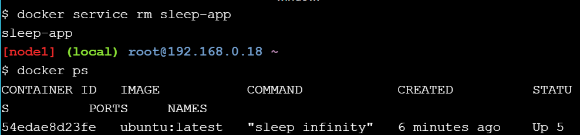
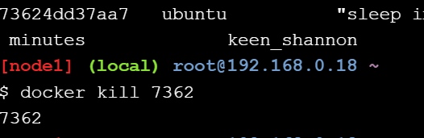
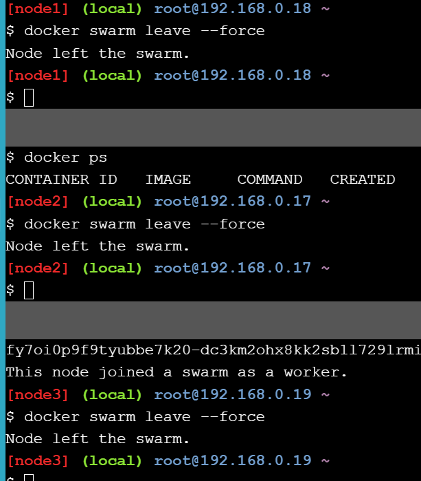

# Orchestration

Dołączenie węzłów do Swarm

Utworzenie nowego serwisu w Docker Swarm

Rozszerzenie liczby kontenerów do 7

Ustawienie dostępności węzła na Drain

Czyszczenie po wszystkich operacjach

