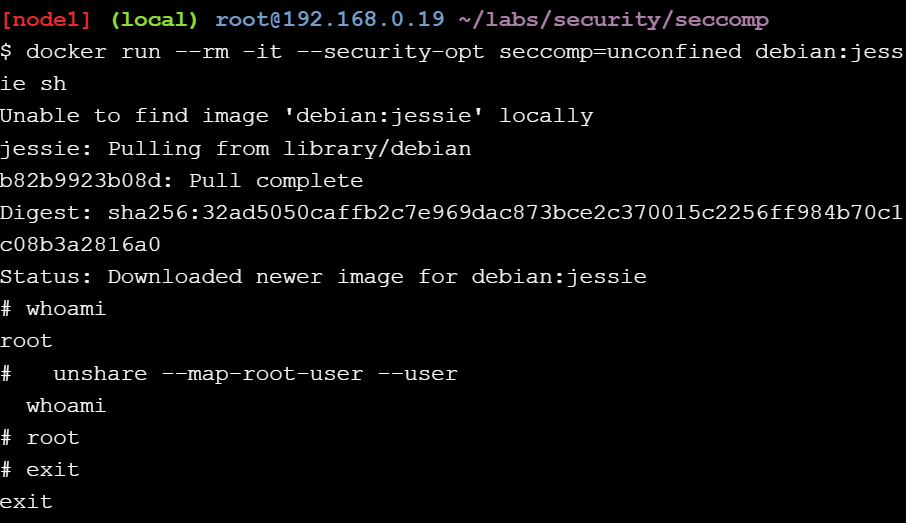
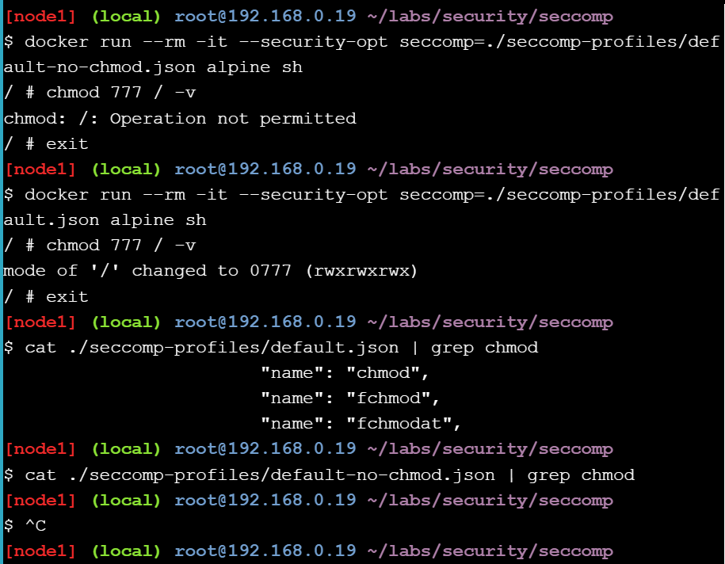

# Lab: Seccomp

Sklonowanie repozytorium i przetestowanie go

Uruchomienie kontenera bez profilu seccomp

Porównanie działania profilu seccomp z zablokowanymi syscallami chmod oraz profilu domyślnego

Wyświetlenie wszystkich wywołań systemowych wykonanych przez ls:

